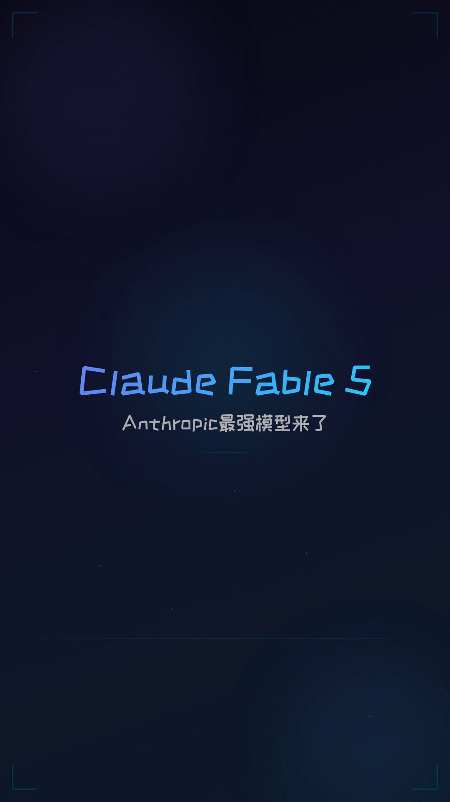
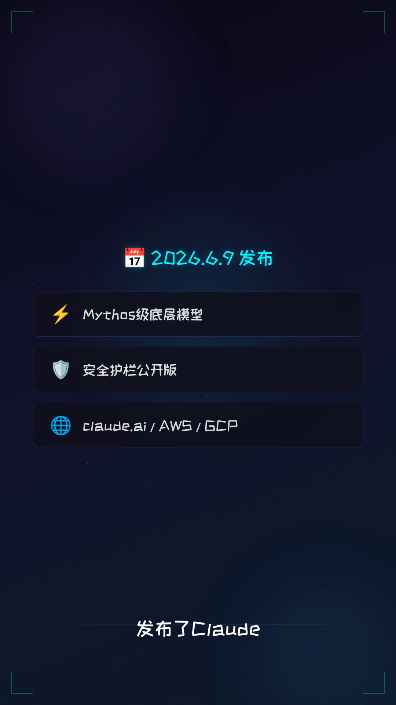
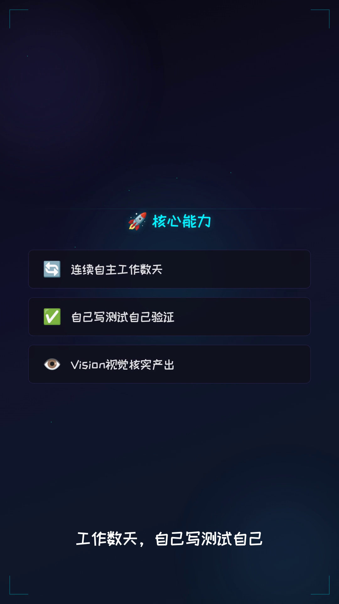
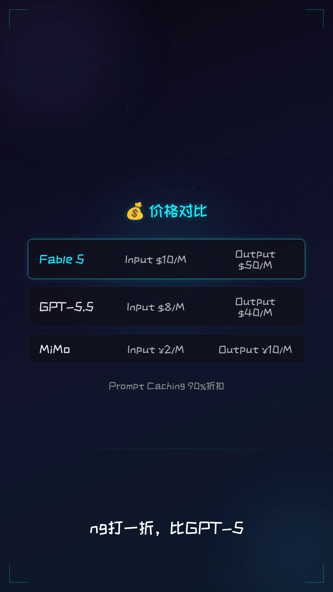

<div align="center">

# 🪟 GlassMotion

### 从 HTML 到专业级视频，一句话的距离

**AI 驱动的玻璃拟态视频生成引擎**

[English](#english) · [中文](#中文介绍)

   

---

https://github.com/user-attachments/assets/xxxxxxxxxxxx

</div>

---

<a name="中文介绍"></a>

## 📖 中文介绍

### 这是什么？

GlassMotion 是一个 **AI 驱动的视频生产引擎**，让你只需要描述需求，就能自动生成带有高级玻璃拟态（Glassmorphism）UI 的专业短视频。

不需要 After Effects。不需要 Premiere。不需要任何视频剪辑经验。

**你说话，AI 写代码，引擎出视频。**

### 核心能力

| 能力 | 说明 |
|:---|:---|
| 🎨 **玻璃拟态设计系统** | 深色科技风 + 光球/粒子/扫描线三层动态背景 + 毛玻璃卡片 + 霓虹强调色 |
| 🤖 **AI 全自动写码** | 你描述场景，AI 自动生成完整 HTML/CSS 动画代码 |
| 🎬 **逐帧渲染引擎** | Playwright/Puppeteer 逐帧截取 → FFmpeg 合成，保证动画丝滑 |
| 🗣️ **TTS 语音合成** | Edge-TTS / MiniMax 自动生成配音，支持中英文多音色 |
| 📝 **智能字幕对齐** | Whisper 词级时间戳驱动，告别「字幕和语音对不上」 |
| ⚡ **1.2x 智能加速** | 自动加速最终视频，节奏紧凑不拖沓 |
| 🖥️ **虚拟录屏** | 模拟 macOS 桌面、终端、代码编辑器、聊天界面，真假难辨 |
| 📱 **竖屏原生** | 1080×1920 原生竖屏，抖音/小红书/Instagram 直接发布 |

### 适用场景

- **科技热点速报** — 新模型发布、产品更新、行业动态
- **产品介绍视频** — 功能演示、卖点展示、价格对比
- **数据可视化** — 图表动画、数据卡片、排行榜
- **教程类短视频** — 操作演示、代码讲解、工具对比
- **社媒引流内容** — 吸睛封面 + 信息密度 + 快节奏

### 为什么选择 GlassMotion？

<details>
<summary><b>🆚 对比传统方案</b></summary>

| | 传统剪辑 | GlassMotion |
|:---|:---|:---|
| 制作时间 | 2-4 小时 | **10-15 分钟** |
| 设计能力要求 | 需要专业设计 | **AI 自动生成** |
| 动画复杂度 | 受限于工具预设 | **CSS 无限可能** |
| 风格一致性 | 人工保证 | **Token 系统统一** |
| 可复用性 | 低 | **模板 + 参数化** |
| 批量生产 | 极难 | **流水线化** |

</details>

### 技术架构

```
用户描述需求
    │
    ▼
┌─────────────────────────────────────────┐
│  AI 编排层                               │
│  ├── 分镜表生成（场景/时长/内容规划）      │
│  ├── HTML/CSS 动画代码生成               │
│  ├── TTS 语音合成                        │
│  └── 字幕时间线对齐（Whisper）            │
└─────────────────────────────────────────┘
    │
    ▼
┌─────────────────────────────────────────┐
│  渲染引擎                                │
│  ├── Playwright 逐帧截图 (15fps)         │
│  ├── FFmpeg 编码 + 合成                  │
│  ├── 1.2x 智能加速                       │
│  └── ASS 字幕烧入                        │
└─────────────────────────────────────────┘
    │
    ▼
  成品 .mp4（竖屏 1080×1920）
```

### 视觉风格

- **配色**：蓝紫渐变主色 + 霓虹青 `#00f0ff` 强调
- **背景**：三层动态效果 — 浮动光球 (Orbs) + 粒子系统 (Particles) + 扫描线 (Scanline)
- **卡片**：毛玻璃质感，白底 3-5% 透明度 + 1px 边框
- **动画**：入场 0.4-0.7s ease-out，标题 shimmer 流光，同屏最多 2 层
- **字体**：ZCOOL KuaiLe 圆体（中文）+ 系统等宽字体（英文/代码）

### 实际案例

本仓库的演示视频展示了 GlassMotion 的完整能力：

> **Claude Fable 5 科普视频**（47 秒竖屏）
> - 9 个场景，完整叙事结构
> - 玻璃拟态卡片 + 动态粒子背景
> - macOS 虚拟录屏场景
> - TTS 配音 + Whisper 词级字幕对齐
> - 1.2x 智能加速

<div align="center">


</div>

---

<a name="english"></a>

## 📖 English

### What is GlassMotion?

GlassMotion is an **AI-powered video production engine** that generates professional short videos with premium Glassmorphism UI — from a simple text description.

No After Effects. No Premiere. No video editing experience required.

**You describe. AI codes. Engine renders.**

### Core Capabilities

| Capability | Description |
|:---|:---|
| 🎨 **Glassmorphism Design System** | Dark tech aesthetic + 3-layer dynamic backgrounds (orbs/particles/scanlines) + frosted glass cards + neon accents |
| 🤖 **AI Code Generation** | Describe a scene, AI generates complete HTML/CSS animation code |
| 🎬 **Frame-by-Frame Rendering** | Playwright/Puppeteer capture → FFmpeg encode for buttery-smooth output |
| 🗣️ **TTS Voice Synthesis** | Edge-TTS / MiniMax auto-generates voiceovers in multiple languages and voices |
| 📝 **Smart Subtitle Alignment** | Whisper word-level timestamp driven — subtitles always match speech |
| ⚡ **1.2x Smart Speed** | Auto-speeds final video for tight, engaging pacing |
| 🖥️ **Virtual Screen Recording** | Simulates macOS desktop, terminals, code editors, chat interfaces |
| 📱 **Native Vertical** | 1080×1920 native portrait — ready for TikTok, Reels, Shorts |

### Use Cases

- **Tech News Explainers** — New model launches, product updates, industry trends
- **Product Demos** — Feature showcases, pricing comparisons, capability highlights
- **Data Visualization** — Animated charts, data cards, rankings
- **Tutorial Shorts** — Code walkthroughs, tool comparisons, how-tos
- **Social Media Content** — Eye-catching covers + information density + fast pacing

### Why GlassMotion?

<details>
<summary><b>🆚 vs Traditional Editing</b></summary>

| | Traditional Editing | GlassMotion |
|:---|:---|:---|
| Production Time | 2-4 hours | **10-15 minutes** |
| Design Skill Required | Professional | **AI-generated** |
| Animation Complexity | Tool presets | **Unlimited CSS** |
| Style Consistency | Manual | **Token system** |
| Reusability | Low | **Template + parametric** |
| Batch Production | Very hard | **Pipeline-ready** |

</details>

### Technical Architecture

```
User describes what they want
    │
    ▼
┌─────────────────────────────────────────┐
│  AI Orchestration Layer                  │
│  ├── Storyboard generation               │
│  ├── HTML/CSS animation code             │
│  ├── TTS voiceover synthesis             │
│  └── Subtitle timeline alignment         │
└─────────────────────────────────────────┘
    │
    ▼
┌─────────────────────────────────────────┐
│  Rendering Engine                        │
│  ├── Playwright frame capture (15fps)    │
│  ├── FFmpeg encode + concat              │
│  ├── 1.2x smart speedup                 │
│  └── ASS subtitle burn-in               │
└─────────────────────────────────────────┘
    │
    ▼
  Final .mp4 (Portrait 1080×1920)
```

### Visual Style

- **Palette**: Blue-purple gradient primary + neon cyan `#00f0ff` accent
- **Background**: 3-layer dynamic — floating orbs + particle system + scanline sweep
- **Cards**: Frosted glass, white 3-5% opacity + 1px border
- **Animation**: 0.4-0.7s ease-out entrance, title shimmer effect, max 2 layers
- **Font**: ZCOOL KuaiLe (Chinese) + system monospace (English/code)

---

## 🚀 Getting Started

> **前置依赖**: Node.js, Python 3, FFmpeg, Chromium (snap)

GlassMotion 是 [Hermes Agent](https://github.com/NousResearch/hermes-agent) 的 skill 插件，运行在 AI Agent 工作流中。

```bash
# 1. 安装 Hermes Agent
curl -sSL https://hermes-agent.nousresearch.com/install | bash

# 2. 加载 GlassMotion skill
hermes skills install glassmotion

# 3. 描述你的视频需求
hermes "做一个关于GPT-5的科普短视频，45秒，深色科技风"
```

### 手动使用（无需 Hermes）

```bash
# 克隆仓库
git clone https://github.com/christopher47634/glassmotion.git
cd glassmotion

# 编辑你的场景 HTML
vim scenes/scene-01.html

# 渲染
python3 render.py --scenes scenes/ --output output.mp4
```

## 📁 Project Structure

```
glassmotion/
├── README.md              # 你正在看的这个
├── examples/
│   ├── fable5-demo.mp4    # 完整演示视频
│   └── frame-*.png        # 场景截图
├── skills/
│   ├── mode2-hyperframes/         # 核心引擎 skill
│   ├── popular-science-video-style/  # 科普视频默认风格
│   └── macos-claude-ui/          # macOS 界面模拟
├── render.py              # 渲染脚本
└── templates/
    └── dark-tech/         # 深色科技风模板
```

## 🎯 Key Features

### 🪟 Glassmorphism by Default

每个场景自动应用毛玻璃设计系统。三层动态背景（光球 + 粒子 + 扫描线）让画面永远不无聊。

### 🤖 AI-Native Workflow

不是「模板替换」，是「AI 从零设计」。每个场景都是独立的 HTML/CSS 动画，由 AI 根据内容定制。

### ⏱️ Whisper Subtitle Sync

告别手动调字幕。Whisper 词级时间戳确保每句话和语音完美对齐。

### 🖥️ Virtual Screen Recording

需要展示 App 界面？AI 直接用 HTML/CSS 模拟 macOS 桌面、终端、聊天窗口，真假难辨。

### 📐 Consistent Design Tokens

一组 Token 控制全片视觉：配色、字体、间距、圆角、阴影。换主题只改 Token，不改代码。

---

## 📊 Demo

### Claude Fable 5 科普视频

> 47 秒 · 9 个场景 · 竖屏 1080×1920

<div align="center">

| 标题卡 | 功能展示 | 价格对比 | 虚拟录屏 | 结尾 |
|:---:|:---:|:---:|:---:|:---:|
|  |  |  |  |  |

</div>

**技术栈**: HTML/CSS 动画 + Edge-TTS + Whisper + FFmpeg + Playwright

---

## 🤝 Contributing

欢迎贡献新的视觉风格、组件模板、动画效果！

1. Fork 本仓库
2. 创建你的分支 (`git checkout -b feature/my-style`)
3. 提交更改 (`git commit -m 'Add my awesome style'`)
4. Push 到分支 (`git push origin feature/my-style`)
5. 开一个 Pull Request

## 📄 License

MIT License. 自由使用，自由修改，自由分享。

---

<div align="center">

**Built with ❤️ by [christopher47634](https://github.com/christopher47634)**

*Powered by [Hermes Agent](https://github.com/NousResearch/hermes-agent)*

</div>
